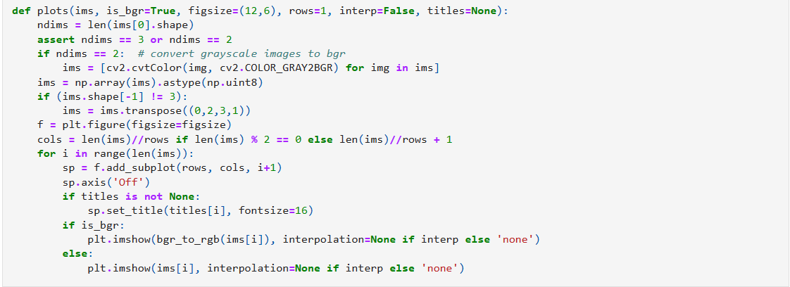
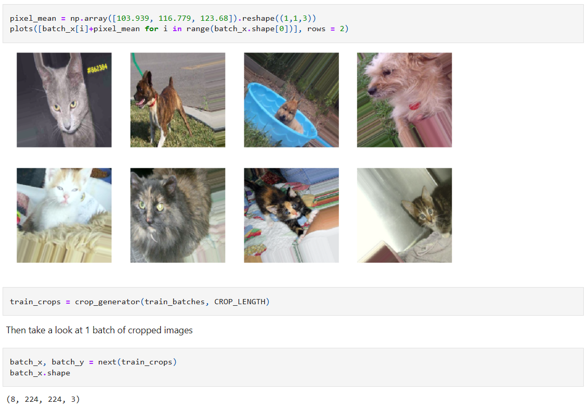

1. **Editor Preference:**
   - Q: Do you prefer using an editor like PyCharm or Jupyter Notebook for machine learning tasks? 
   - A: I prefer PyCharm. If there's an error like a misspelled function name, I can catch it immediately in PyCharm, whereas in Jupyter, errors are discovered only when running.

2. **Challenges with Jupyter Notebook:**
   - Q: What challenges do you find when using Jupyter Notebook for machine learning tasks, and what additional features do you think Jupyter should have?
   - A: Defining custom functions, especially when dealing with multi-threading issues, can be cumbersome in Jupyter. It needs better support for such function definitions.

3. **Model Training Steps:**
   - Q: What steps do you generally follow in the machine learning process, and are there any steps that particularly bother you?
   - A: Training models, especially in multi-threaded cases like XGBoost or hyperparameter tuning, takes a lot of time.

4. **Frustrating Steps:**
   - Q: What specific characteristics of the mentioned frustrating steps make them bothersome to you?
   - A: Even with tools like tqdm to observe progress, training is slow. If tqdm doesn't move for a long time, I start suspecting if the code is still running. Also, multi-threading errors may not appear in Jupyter but in the terminal, making them hard to notice.

5. **AutoML Tools in Jupyter:**
   - Q: Have you tried incorporating AutoML tools or Python libraries in Jupyter notebooks to assist with your machine learning work? If yes, how do you find them?
   - A: No, I haven't.

6. **Improvements for Used Libraries:**
   - Q: Is there anything you would like to see improved in the Python libraries you have used for assistance in machine learning tasks?

7. **Code Development Approach:**
   - Q: When working on machine learning tasks, do you prefer modifying existing code found online or starting from scratch? What's your reasoning?
   - A: I prefer modifying existing code. Having a general framework helps in writing my code more efficiently.

8. **Understanding Others' Code:**
   - Q: When you come across machine learning code in Jupyter notebooks written by others or when someone modifies your code, do you find it challenging to understand new workflows? What specifically makes it difficult?
   - A: I don't usually spend a lot of time understanding. However, due to Jupyter notebook version differences, sometimes the code presented by others runs but not on my version, requiring time to identify the issues.

9. **Data Saving Practices:**
   - Q: If you have experience writing code for machine learning tasks, do you regularly record or save data in your notebooks or code (e.g., code progress, run results)? If yes, what data do you typically save, and if not, does the absence of this data bother you?
   - A: I save data to CSV files corresponding to the amount of data processed. This includes data used for feature processing or direct machine learning. In terms of code, I record how much I've run and where to resume (tracked using tqdm library).

10. **Code Clarity:**
    - Q: Are there any parts of the code mentioned above that you find confusing, or do you think the author needs more explanation? If so, what specific information would you like clarification on (e.g., package functionality, code segment purpose, cell interactions)?
    - A: Possibly, each function definition needs comments explaining how it is used and what its purpose is.

11. **Real-time Visualization:**
    - Q: If you have experience developing models from scratch, do you wish for real-time visualizations expressing your progress during model development?
    - A: Yes.

12. **Desired Jupyter Assistance:**
    - Q: In your machine learning process using Jupyter, what additional help or features do you wish Jupyter could provide?
    - A: Integration of features like Copilot for enhanced coding assistance.

