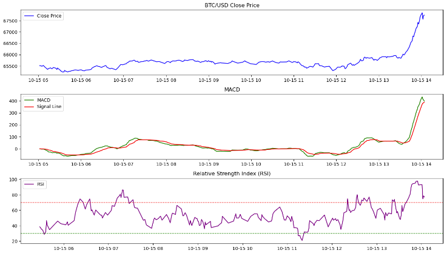
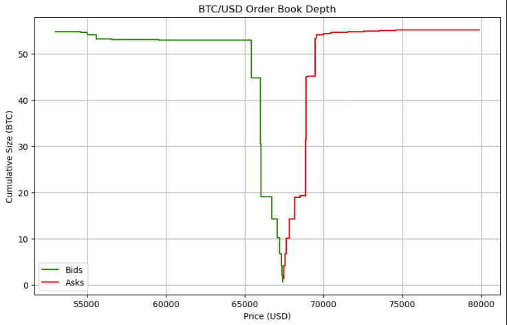
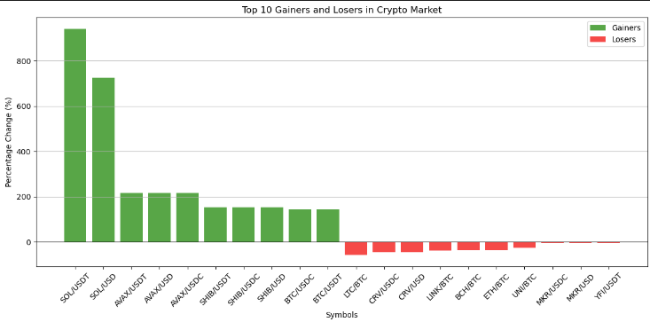
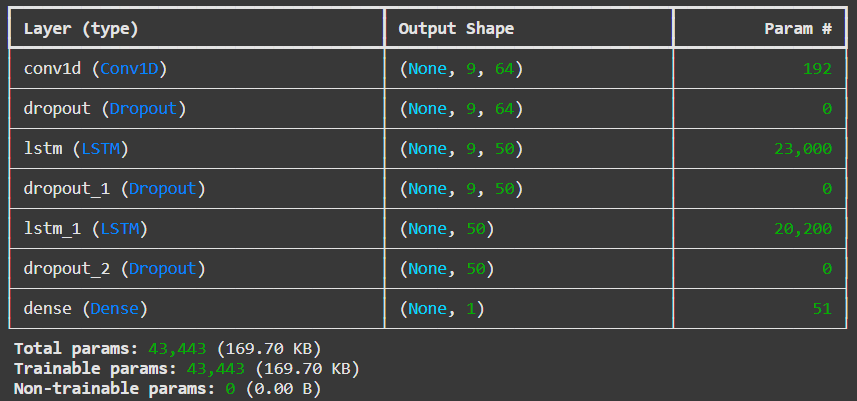

# LLM for Automated Trading
Project Link: https://kaixu.me/2023/09/15/llm-for-automated-trading/

## Meeting Minutes and to:do
[Meeting Minutes Markdown](meetingMinutes.md)

# MVP
## Trading System: Minimal Working Demo To-Do List

## 1. Data Input
- [x] **Obtain historical data**: 
  - Fetch data from a reliable source (Alpaca API).
  - Ensure that data contains required fields like timestamp, price, volume, etc.
  - 

- [ ] **Load and preprocess data**: 
  - Clean missing or invalid data.
  - Convert data to suitable formats for processing (Pandas DataFrame).
  - Ensure time is sorted and no out-of-sequence data points.

## 2. Trade Decision Logic (Rule-based)
- [x] **Define trading rules**: 
  - Create basic rules for entering and exiting trades (threshold-based conditions).
- [x] **Implement trading strategy**: 
  - Code the rules to decide whether to buy/sell based on the current data.
  - Test the decision logic independently with sample data.

## 3. Trade Execution
- [x] **Simulate trade execution**:
  - Create a basic trading function to simulate buy/sell orders. (Alpaca paper trading)
  - Ensure it records the amount traded, price, and time of the trade.
  - Account for transaction costs (if applicable) and apply them in the logic.

## 4. Performance Tracking
- [x] **Track trade history**: 
  - Store each executed trade with relevant details (price, quantity, etc.).
- [x] **Calculate performance metrics**: 
  - Track portfolio value over time.
  - Calculate metrics such as RSI, MACD, ROI, or Sharpe ratio for simple performance evaluation.
  
## 5. Output and Logging
- [x] **Generate logs**: 
  - Log every trade, decision, and performance updates.
- [x] **Output final results**: 
  - Create a summary of trading performance at the end of the simulation (e.g., total profit, number of trades).
  
## 6. Testing and Validation
- [x] **Test with sample data**: 
  - Run the system with a sample dataset to check for any bugs or incorrect trade executions.
  - Ensure that all modules are working together without errors.

## 7. Documentation
- [x] **Write documentation**: 
  - Document the design and functionality of each component.
  - Describe the inputs, outputs, and assumptions made in the system.

# Technical Analysis: 
1 - Bitcoin price trend for 1 hour candles

2 - BTC\USD MACD, RSI

3 - BTC/USD Order Book

4 - BTC/USD Historical Trades

5 - Top 10 gainers and losers

# Sentiment Analysis: 
The following are getting the data from the respective news outlets and finding the sentiment analsysis of different things from -2 and 2 using the gemini api.

## Reddit
This image shows the last 50 articles of news after Trump's reelection for crypto and bitcoin and it's sentiment analysis between -2 and 2.

Using the subreddits: ["CryptoCurrency", "CryptoMarkets", "Bitcoin", "CryptoNews"]

This image shows the VEDAR sentiment analysis which is a libarary in Python that is good for social media sentiment analysis

## News 
This image shows the last 50 articles of news after Trump's reelection for Bitcoin and it's sentiment analysis between -2 and 2.

# CNN-LSTM Model
This is the MVP model I developed on 30 days. As cryptocuurency is more volitile and doesn't have trends of 30 days the model has not been trained correctly

1 - The parameters for the CNN-LSTM

