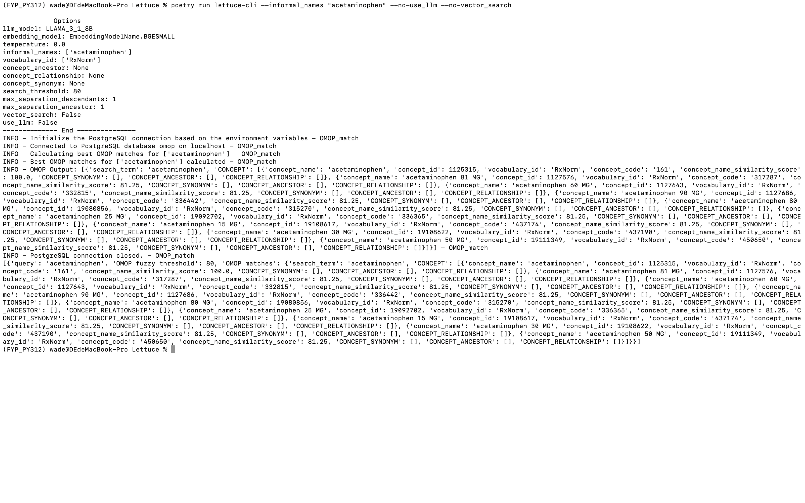

# LLM for Qualitative Analysis:Medical data integration

## Project Tasks

### Interface
- **Gradio**: Created a simple interface using Gradio (✅ Completed in the Minimal Working Demo). 

- **Project management**: Split the project into [app.py](projects/app.py) for the interface and [backend.py](projects/backend.py) for core logic. This structure improves readability, maintainability, and allows for easier collaboration (✅ Completed in the first week of November).

- **Save Functionality**:  Implemented a feature to export mapping results as .xlsx files with user-defined filenames (✅ Completed in the first week of November).

- **Improve the interface**: The [interface](projects/app2.py) is now more interactive, and users can select cells and get mapping suggestions (✅ Completed in the fourth week of February).

### Data Preprocessing
- **Data Loading**: Users can now select an Excel file directly from the interface and load its contents. Additionally, they can choose specific sheets within the file for processing, enhancing flexibility and ease of use (✅ Completed in the Minimal Working Demo).
- **Benchmark Dataset**: Downloaded the [Benchmark Dataset](https://github.com/meniData1/MIMIC_2_OMOP) from an online source (✅ Completed in the first week of November).
- **Clean the Data**: Implement a [function](projects/removeSomeData.py) to clean the dataset by removing all NaN values (✅ Completed in the third week of November).

### Prepare the LLaMA
- **LLaMA**: Downloaded the LLaMA 3.1-8B-Instruct model from the official website (✅ Completed in the second week of November).
- **API Construction**: Utilized [ollam](https://ollama.com/) to construct a LLaMA API for streamlined integration and usage (✅ Completed in the second week of November).

### Direct Mapping Use LLaMA
- **Try to use LLaMA do direct mapping**: Use [try.py](projects/try.py)(✅ Completed in the second week of November)
  - **Provide Full OMOP List to LLaMA**: The mapping results were suboptimal. Due to the excessive length of the list, LLaMA often failed to focus on the mapping task and instead generated responses analysing the content of the list.
  - **Provide a Subset of the OMOP List to LLaMA**: The mapping results improved compared to using the full list but remained inaccurate. Additionally, the same input often produced inconsistent outputs. 

  Some thoughts based on  Simply providing the list of names may not be sufficient for accurate mapping. For instance, when asking LLaMA to map "big" to [Large, Tiny, Glad, Unhappy], the results can vary due to LLaMA interpreting "big" differently depending on the context (e.g., treating "big" as a general word or as a mathematical term). Therefore, it may be necessary to include additional descriptions to clarify the intended meaning.

### Improve the Mapping
- **LangChain Prompt Optimization**: Explored LangChain features to refine prompts, resulting in improved mapping accuracy and relevance (✅ Completed in the third week of November).  

- **Structured Outputs for Mapping Results**: In the implementation, I optimized the data mapping output format by calling the LLM API twice, [the code](projects/StructuredOutputs.py) (✅ Completed in the fourth week of November). 
  - **First Call**: Generate an initial mapping result using the LLM. The goal is to provide a best-match suggestion based on the input data item and the controlled vocabulary.
  - **Second Call**: Use the result from the first call as input and further extract it into a structured dictionary format. The goal is to facilitate subsequent analysis and operations.

  Now the output is like (The last line): 

- **Retrieval Augmented Generation (RAG)**: Acquired knowledge about RAG and implemented a simple RAG-based approach: [the getSimilarDes function](projects/RAG.py). The process involves using the (TableName, ColumnName) from the MIMIC vocabulary as input to retrieve the corresponding ColumnDesc. Then, the ColumnDesc from MIMIC is used to query the top 5 most similar descriptions from the OMOP ColumnDesc. The retrieved results are provided to the LLM during the first call to enhance the quality of its outputs (✅ Completed in the fourth week of November). 

### Switch to Lettuce 
- **Deploy**: Read the Lettuce documentation and deploy it locally (✅ Completed in the fourth week of February).

### Result Checking and Editing
- **Evaluate Function**: Wrote a [function](projects/CheckResult.py) that checks the accuracy of attribute mappings in the input dictionary by matching them against standard mappings in the database and returns the accuracy rate (✅ Completed in the first week of November).

### Next Steps
- **Meeting with Esmond to obtain user needs**: (❌ Not yet completed)

 

