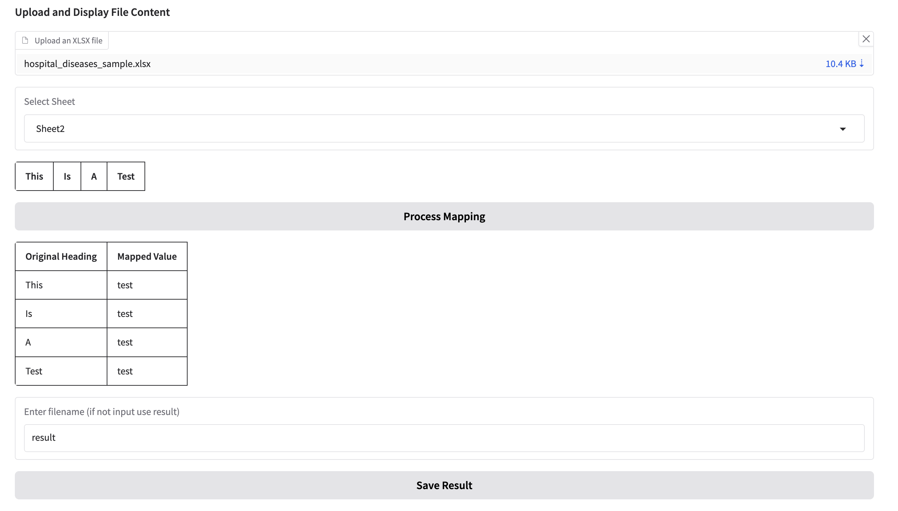
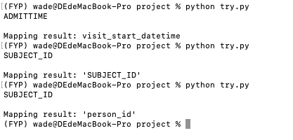

# LLM for Qualitative Analysis:Medical data integration

## Project Tasks

### Interface
- **Gradio**: Created a simple interface using Gradio (✅ Completed in the Minimal Working Demo). 

- **Project management**: Split the project into [app.py](projects/app.py) for the interface and [backend.py](projects/backend.py) for core logic. This structure improves readability, maintainability, and allows for easier collaboration (✅ Completed in the first week of November).

- **Save Functionality**:  Implemented a feature to export mapping results as .xlsx files with user-defined filenames (✅ Completed in the first week of November).

### Data Preprocessing
- **Data Loading**: Users can now select an Excel file directly from the interface and load its contents. Additionally, they can choose specific sheets within the file for processing, enhancing flexibility and ease of use (✅ Completed in the Minimal Working Demo).
- **Benchmark Dataset**: Downloaded the [Benchmark Dataset](https://github.com/meniData1/MIMIC_2_OMOP) from an online source (✅ Completed in the first week of November).

### Prepare the LLaMA
- **LLaMA**: Downloaded the LLaMA 3.1-8B-Instruct model from the official website (✅ Completed in the second week of November).
- **API Construction**: Utilized [ollam](https://ollama.com/) to construct a LLaMA API for streamlined integration and usage (✅ Completed in the second week of November).

### Direct Mapping Use LLaMA
- **Try to use LLaMA do direct mapping**: Use [try.py](projects/try.py)(✅ Completed in the second week of November)
  - **Provide Full OMOP List to LLaMA**: The mapping results were suboptimal. Due to the excessive length of the list, LLaMA often failed to focus on the mapping task and instead generated responses analysing the content of the list.
  - **Provide a Subset of the OMOP List to LLaMA**: The mapping results improved compared to using the full list but remained inaccurate. Additionally, the same input often produced inconsistent outputs. 

  Some thoughts based on  Simply providing the list of names may not be sufficient for accurate mapping. For instance, when asking LLaMA to map "big" to [Large, Tiny, Glad, Unhappy], the results can vary due to LLaMA interpreting "big" differently depending on the context (e.g., treating "big" as a general word or as a mathematical term). Therefore, it may be necessary to include additional descriptions to clarify the intended meaning.

### Result Checking and Editing
- **Evaluate Function**: Wrote a [function](projects/CheckResult.py) that checks the accuracy of attribute mappings in the input dictionary by matching them against standard mappings in the database and returns the accuracy rate (✅ Completed in the first week of November).

### Next Steps
- **Explore Additional LLMs with Ollama**: (❌ Not yet completed)
- **Further Modify the Benchmark Dataset**: (❌ Not yet completed)
- **Attempt Direct Mapping Using GPT**: (❌ Not yet completed)

 

